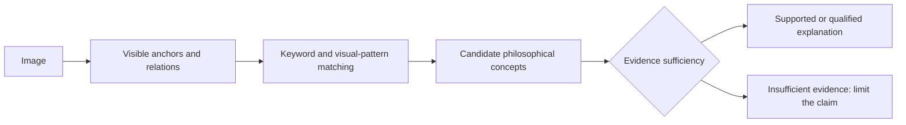

# PhiloVista-1800

**A Multi-source Benchmark for Grounded Philosophical Image Understanding**

[中文说明](README_ZH.md) · [Benchmark framework](docs/BENCHMARK_FRAMEWORK.md) · [Technical report](docs/TECHNICAL_REPORT_ZH.md) · [632-concept label system](ontology/README.md)

Can a vision-language model connect visible evidence to a defensible philosophical interpretation, and recognize when the evidence is insufficient?

This project combines a **632-concept label system**, the **PhiloVista-1800 dataset**, annotation schemas, and an evaluation framework. PhiloVista-1800 supplies 1,800 images from four source datasets and English multi-reference AI draft annotations. The benchmark examines visual evidence recognition, concept selection, grounded explanation, and restraint against overinterpretation.

> **Status: research preview, framework aligned (2026-09-09).** All 1,800 records remain reviewed AI drafts (`formal_gold=false`). The ontology, framework sidecar, and group-level splits are available. Independent human PHC mapping, gold annotations, agreement scores, and quantitative model baselines remain pending. Images are present in [`images/`](images/); per-image rights status remains recorded in the manifest.

## Benchmark at a glance

| Component | Available resource | Status |
|---|---|---|
| Label system | 632 concepts with stable `PHC-xxx` IDs, keywords, visual patterns, and grounding constraints | `formal-632-20260909` |
| Dataset | 1,800 images; 1,620 positive and 180 boundary controls | Included with provenance |
| Reference annotations | Scene / Action / Rationale / Object and philosophical candidates | Reviewed AI drafts |
| Framework integration | Legacy axes, formal retrieval candidates, per-concept claim schema | Human claim mapping pending |
| Data split | Calibration 180 / dev 180 / test 1,440 | Deterministic assignment by `group_id` |
| Evaluation | Four task definitions and proposed reporting rules | Scorer and model results pending |

**632 concepts, 11 legacy thematic axes, and 1,800 images describe different resources.** The dataset has not been established as a 632-class gold classification benchmark.

## Label system: conceptual and concrete layers

| Layer or role | CSV fields | Meaning |
|---|---|---|
| Conceptual layer | `Philosophical Concept`, `Concept ID` | Philosophical concepts to identify and distinguish |
| Concrete layer: keyword cues | `Symbolic Keywords` | Semantic, symbolic, or relational cues connecting observations to concepts |
| Concrete layer: visual patterns | `Visual Evidence Patterns` | General object, action, composition, and relationship patterns |
| Concept organization | `Macro Dimension`, `Subdomain`, `Tradition / School` | Categories and intellectual context |
| Evidence constraints | `Visual Inferability`, `Temporal Requirement`, `Grounding Rule` | Limits on what an image can support |

Symbolic Keywords belong to the concrete side of this representation, but some keywords are interpretive rather than directly observable. A keyword match retrieves a candidate; it does not establish a philosophical claim. General CSV patterns must be distinguished from the actual `visual_anchors` in each image. `symbolic_mapping` records the explanatory connection without requiring a separate symbolic label layer.



The ontology contains **158 Ontology**, **132 Epistemology**, and **342 Axiology** entries. Resource statuses are **416 `candidate`** and **216 `ontology_only`**; these do not establish dataset coverage. See the [field guide and version lock](ontology/README.md).

## Dataset composition

| Source | Positive | Boundary | Total |
|---|---:|---:|---:|
| HL Dataset | 500 | 100 | 600 |
| HAIVMet | 550 | 0 | 550 |
| IRFL | 420 | 80 | 500 |
| MM-MoralBench | 150 | 0 | 150 |
| **Total** | **1,620** | **180** | **1,800** |

Positive images may support philosophical, moral, abstract, or figurative interpretation. Boundary controls are valid images for which strong philosophical assertions lack evidence. A positive image may still have insufficiently supported candidate explanations; boundary images should still receive accurate ordinary descriptions.

Boundary controls currently come only from HL and IRFL. Report positive/boundary results within those sources as well as overall, so source style is not mistaken for evidence sensitivity.

Each AI draft has **3 Scene, 3 Action, 3 Rationale, 5 Object references**, and **3 philosophical candidates**. Multiple AI references are not independent human judgments. The future human/adjudicated schema permits **0–3 accepted explanations** per image.

## Four evaluation tasks

These are proposed tasks and reporting rules; no baseline scores are claimed in this release.

| Task | Output | Proposed evaluation |
|---|---|---|
| T1 Visual evidence recognition | Objects, actions, relations, and anchors | Evidence correctness, omissions, invented facts |
| T2 Philosophical concept selection | Formal `PHC-xxx` concepts or ranked candidates | Multi-label F1 / Recall@k on a human-validated core subset |
| T3 Grounded philosophical explanation | Concept claims linked to evidence, qualifications, and alternatives | Visual support, concept fit, coherence, overinterpretation risk |
| T4 Evidence sufficiency and restraint | Support judgment for a specified claim; explanation or abstention | Sufficiency macro-F1, boundary overinterpretation rate, positive valid-explanation coverage |

The main input is the image and a standardized task prompt; T4 additionally supplies the same candidate claim to each model. Source labels, upstream answers, tracks, and answer-derived crosswalk candidates must not be test inputs. Text visible inside an image is part of the image input. See the [evaluation protocol](docs/BENCHMARK_FRAMEWORK.md).

## Resources and data compatibility

| Resource | Purpose |
|---|---|
| [Formal 632 CSV](ontology/philosophical_image_label_system_formal_632.csv) / [version lock](ontology/formal_632.lock.json) | Canonical concept resource, SHA-256, and counts |
| [Selection manifest](final_selection_1800/final_selection_manifest.csv) | Provenance, tracks, image hashes, and rights status |
| [Split manifest](splits/benchmark_splits.csv) | Group-level calibration/dev/test assignments |
| [Per-image JSON](annotation_workflow/drafts/api_en/items/) | 1,800 authoritative AI draft records |
| [HL JSONL](annotation_workflow/drafts/api_en/exports/PhiloVista-1800_HL.jsonl) / [HL CSV](annotation_workflow/drafts/api_en/exports/PhiloVista-1800_HL.csv) | Four description fields; CSV retains Chinese headers and English text |
| [Legacy philosophy JSONL](annotation_workflow/drafts/api_en/exports/PhiloVista-1800_philosophy.jsonl) | Original philosophy export with the old `concept_ids` field |
| [Framework JSONL](annotation_workflow/drafts/api_en/exports/PhiloVista-1800_framework.jsonl) | Legacy axes, formal retrieval candidates, and explicit pending claims |
| [Core-concept candidate pack](annotation_workflow/resources/core_concept_candidates_v1.csv) | Rule-based evidence tiers for the 29 retrievable concepts (A 14 / B 10 / excluded 5) |
| [Neighbor pairs](annotation_workflow/resources/core_concept_neighbor_pairs_v1.csv) | Discrimination worksheet: same-axis, same-subdomain, and lexical neighbors per concept |
| [Calibration worksheet](annotation_workflow/calibration/v1/calibration_mapping_worksheet_v1.csv) | Blind PHC-mapping instrument for the 180 calibration images (no AI suggestions) |

In the framework sidecar, `legacy_axis_ids` retains the 11 old themes, `formal_concept_candidates` contains crosswalk retrieval suggestions, and `concept_claims` remains empty pending independent per-image human mapping. The crosswalk references **29 distinct PHC candidates**; this is not confirmed concept coverage. `benchmark_axis_id` is an administrative preclassification.

The [draft schema](annotation_workflow/schemas/framework_draft_record.schema.json) describes the sidecar. The [human/adjudicated schema](annotation_workflow/schemas/philosophy_record.schema.json) targets a future release and is not the schema of the legacy AI export.

## Quick start

Clone the repository and run examples from its root. Cloning also transfers the included 1,800 image files.

```bash
git clone https://github.com/SimonJYTP/PhiloVista-1800-A-Multi-source-Benchmark-for-Grounded-Philosophical-Image-Understanding.git
cd PhiloVista-1800-A-Multi-source-Benchmark-for-Grounded-Philosophical-Image-Understanding
```

Read a framework record and locate its image using the Python standard library:

```python
import json
from pathlib import Path

path = Path("annotation_workflow/drafts/api_en/exports/PhiloVista-1800_framework.jsonl")
with path.open(encoding="utf-8") as handle:
    records = [json.loads(line) for line in handle]

record = records[0]
print(len(records))  # 1800
print(Path("images") / record["file_name"])
print(record["interpretations"][0]["legacy_axis_ids"])
print(record["interpretations"][0]["formal_concept_candidates"])  # suggestions only
print(record["interpretations"][0]["concept_claims"])  # []
```

Read the ontology:

```python
import csv

with open("ontology/philosophical_image_label_system_formal_632.csv",
          encoding="utf-8-sig", newline="") as handle:
    concepts = list(csv.DictReader(handle))
print(len(concepts))  # 632
print(concepts[0]["Concept ID"], concepts[0]["Philosophical Concept"])
```

Rebuild exports and framework artifacts (Python 3.10+):

```bash
python annotation_workflow/scripts/export_english_api_drafts.py
python annotation_workflow/scripts/build_framework_release.py
python annotation_workflow/scripts/build_core_concept_pack.py
```

The framework builder uses the CSV included in `ontology/`; no parent workspace is required. `--ontology-csv PATH` explicitly replaces the bundled source for a rebuild. Changing the ontology requires a deliberate resource-version update before publication. Preserve the default split seed for comparisons with this release. The core-concept pack builder verifies the ontology SHA-256 against the version lock before writing worksheets.

Run the image and annotation audit:

```bash
python -m pip install -r requirements.txt
python annotation_workflow/scripts/audit_annotation_dataset.py
```

## Validation and remaining work

The current quality report records **1,800 parsed and unique items**, **0 critical/high findings**, CSV/JSONL round-trip consistency, and **17 medium review reminders**. Automated checks do not certify philosophical correctness. Existing repair receipts cover 33 items; the framework log separately records nine later visual repairs. These counts should not be added as if they represented disjoint sets.

The split has **180 calibration / 180 dev / 1,440 test images**, with **zero `group_id` overlap**. This check does not establish that every semantic near-duplicate has been eliminated. Reference drafts are public; the split is a reproducible research partition, not a hidden-test service.

Before formal scoring, complete independent human PHC mapping, pre-adjudication agreement measurement, adjudication, core-concept selection, and scoring-rule calibration. Compare direct interpretation, anchors-first prompting, ontology-assisted retrieval, and grounding constraints under matched inputs. Knowledge-graph enhancement is an optional future comparison; no graph-based improvement is claimed here.

## Provenance and image availability

Qwen was the primary draft generator and GLM the primary visual reviewer, with recorded DeepSeek fallbacks. Six records carry a direct reannotation method; additional revisions are retained under per-item review provenance. Every record remains `formal_gold=false`, `needs_independent_human_annotation=true`, and `needs_independent_human_rating=true`.

Image binaries are included in [`images/`](images/). Resolve them as `images/<file_name>`; historical manifest paths retain the original selection layout. Per-image source and rights metadata remain in the manifest. Repository availability does not resolve pending rights review or grant additional upstream permissions. No project-wide annotation license has been declared.

## Documentation

- [中文 README](README_ZH.md)
- [Benchmark framework and evaluation protocol](docs/BENCHMARK_FRAMEWORK.md)
- [Technical report / 技术说明](docs/TECHNICAL_REPORT_ZH.md)
- [632-concept field guide](ontology/README.md)
- [Framework alignment and remaining human work](docs/FRAMEWORK_ALIGNMENT_ZH.md)
- [Core-concept pack and calibration worksheets](docs/CORE_CONCEPT_AND_CALIBRATION_ZH.md)
- [Annotator guide](docs/ANNOTATOR_GUIDE.md)
- [Annotation workflow](docs/ANNOTATION_WORKFLOW.md)
- [Human annotation plan](docs/ANNOTATION_PLAN_ZH.md)
- [Framework validation report](audit/framework_alignment_20260909/framework_alignment_report.json)
- [Core-concept pack report](audit/core_concept_pack_20260909/core_concept_pack_report.json)
- [Annotation quality report](audit/annotation_quality_v1/PhiloVista-1800_quality_report.json)

## Citation

```bibtex
@misc{philovista1800_2026,
  title        = {PhiloVista-1800: A Multi-source Benchmark for Grounded Philosophical Image Understanding},
  author       = {SimonJYTP},
  year         = {2026},
  howpublished = {GitHub repository},
  url          = {https://github.com/SimonJYTP/PhiloVista-1800-A-Multi-source-Benchmark-for-Grounded-Philosophical-Image-Understanding}
}
```
