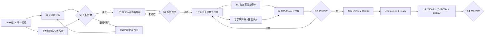

# PhiloVista-1800：1800 张图片标注执行计划与框架工作流

版本：1.0  
日期：2026-09-06  
执行对象：`NewBenchmark/PhilosophyHL_v3/final_selection_1800/`  
当前状态：1,800 张图片已完成 AI 审计终选，尚未完成两名独立人工筛选、逐图权利核验和正式标注。

本文件是 PhiloVista-1800 的 1,800 张终选图片标注执行依据。与早期 1,500 张规划冲突时，以本文件和 `PhilosophyHL_v3/annotation_workflow/annotation_config.json` 为准。标注内容从零生成；来源数据中的短语、标签、题目、答案和旧 HL 描述只用于管理员溯源与后验审计，不展示给标注者，也不能复制为新标注。

## 1. 目标与冻结决策

### 1.1 当前样本构成

| 来源 | 正向 | 边界 | 合计 |
|---|---:|---:|---:|
| HL Dataset | 500 | 100 | 600 |
| MM-MoralBench | 150 | 0 | 150 |
| HAIVMet | 550 | 0 | 550 |
| IRFL | 420 | 80 | 500 |
| 合计 | **1,620** | **180** | **1,800** |

### 1.2 主数据结构

最终兼容 CSV 固定为以下五列，列名、大小写和顺序不得改变：

```text
图片文件名,Scene场景描述,Action动作描述,Rationale理由描述,Object物体描述
```

- 每图 `Scene`、`Action`、`Rationale` 各 3 条独立参考。
- 每图 `Object` 5 条独立完整视觉描述，不是物体标签列表。
- CSV 单元格使用全角分号 `；`（U+FF1B）连接参考；单条参考内部禁用该字符。
- JSONL 为结构化真源，CSV 仅由冻结 JSONL 自动导出，禁止人工直接合并最终 CSV。
- 所有新标注统一使用英文 `en`；兼容 CSV 仍保留上述固定中文列名，但所有单元格内容必须为英文。
- 旧中文试标仅保留为历史校准材料，不得混入英文导出；翻译稿不计为新的独立参考。

### 1.3 HL 官方样式的完整对应

最终 `annotations/{train,test}.jsonl` 每图一行，顶层保持：

```json
{
  "file_name": "PHL1800_HL_0001.png",
  "captions": {
    "scene": ["...", "...", "..."],
    "action": ["...", "...", "..."],
    "rationale": ["...", "...", "..."],
    "object": ["...", "...", "...", "...", "..."]
  },
  "confidence": {
    "scene": [1, 1, 1],
    "action": [1, 1, 1],
    "rationale": [1, 1, 1]
  },
  "purity": {
    "scene": [0.0, 0.0, 0.0],
    "action": [0.0, 0.0, 0.0],
    "rationale": [0.0, 0.0, 0.0]
  },
  "diversity": {
    "scene": 0.0,
    "action": 0.0,
    "rationale": 0.0
  }
}
```

上例数字只是结构示意，不能作为正式占位值发布。`confidence` 必须来自与描述作者不同的独立评分者；`purity` 和 `diversity` 必须在文本冻结后由版本固定的程序计算。若指标实现尚未冻结，则保留在内部状态，不得用 0 或伪造数字宣称已完全复刻 HL。

哲学解释、可见锚点、主体、标注者、来源、分区和审计信息全部写入 `extensions/`，不向上述 HL 顶层添加自定义字段。

## 2. 总体工作流与门禁



### G0：入标门禁

一张图只有同时满足以下条件才能进入正式标注：

1. 两名人工筛选者独立提交结果；筛选时只看图和盲号。
2. 文件可解码、SHA-256 与终选 manifest 一致。
3. 权利状态允许当前研究处理；公开发布所需证据另行记录。
4. 正向样本满足：两人 `visual_self_sufficiency=2`，且 `abstract_relevance>=1`、`evidence_strength>=1`，结论均为 `positive`。
5. 边界样本满足：图像本身可描述，两人均确认它适合检验“证据不足/过度解读”，结论均为 `boundary`；不得因损坏、模糊或完全无内容而充当边界。
6. 任一分数差异达到 2、轨道判断不同、任一人选择 reject，均交第三人仲裁。

终选目前恰好为 1,800 张，人工拒绝会形成缺口。因此 G0 开始前建立约 200 张管理员备用池；替补顺序为“同来源、同正向/边界轨、优先补齐哲学轴缺口”，替补也必须完整走 G0。不得把未过门禁的原图直接替换进正式集。

### G1：试标与指南冻结门禁

使用已有 100 张先导集合（HL 30、MM 10、HAIVMet 30、IRFL 30），但必须先通过 G0。所有人完成训练集和资格题后，才开始独立试标。试标结束需满足：

- 结构完整率 100%，无非法分隔符、空白占位或错图。
- Scene/Action/Object 的抽检严重错误率不超过 5%。
- Rationale 中无证据具体身份、关系、地点和心理的比例不超过 10%；其余改用证据不足或较弱常识表述。
- HL 置信度评分的加权一致性达到预设最低门槛；建议先用 weighted kappa ≥ 0.60，未达到时修订示例并重新校准，不能静默降低标准。
- 哲学评分对 accept/revise/reject 的一致性建议 Krippendorff's alpha ≥ 0.67；若样本量不足，至少报告原始一致率和混淆表。
- 单任务中位时长、P90 时长和退修率已实测，可据此冻结人员与进度计划。

### G2：批次验收门禁

正式 1,800 张按 36 个数据批次、每批 50 张管理。已有 100 张试标占 B001–B002；指南冻结后，B003–B036 才进入正式生产。每批必须满足：

- 每图 3 个主标注包、2 个补充 Object、9 个 HL 置信度分数、3 份哲学解释各 2 次独立评分。
- 参考数量、ID 唯一性、枚举值、时间戳、指南版本与作者/评分者隔离规则全部通过。
- 至少抽检本批 20%；高风险来源、边界样本、文字依赖样本和自动规则命中样本 100% 复核。
- 需要 revise 的记录不得进入冻结区；修改必须保留原记录和 adjudication log。

### G3：发布验收门禁

- 1,800 个文件均存在、可解码、哈希一致，且与主表一一对应。
- 组级切分无跨 split 泄漏；最终目标为 calibration 180、dev 180、test 1,440，若分组约束造成偏差需记录实际数。
- HL CSV 精确五列；每图参考数为 3/3/3/5；JSONL 与 CSV 往返一致。
- `confidence` 与参考逐项对齐；`purity`、`diversity` 有固定实现、版本和运行收据。
- 哲学 sidecar、来源、权利、标注 provenance、独立评分和仲裁记录可追溯。
- 180 个边界样本单独可识别，不能混入正向主指标。

## 3. 角色与独立性

推荐最小角色池如下。一个人可跨角色，但不能评分或仲裁自己的记录。

| 角色 | 推荐人数 | 职责 | 禁止事项 |
|---|---:|---|---|
| 数据管理员 | 1 | 盲化、批次、ID、版本、导出、备份 | 不能向标注者泄露来源答案 |
| 人工筛选者 | 2 | 完成 1,800 张 G0 独立盲筛 | 相互查看结果后再填写 |
| 筛选仲裁者 | 1 | 裁决筛选冲突和替补 | 直接覆盖原始意见 |
| 主标注者 | 6–8 | 每图 3 人分别提交四轴各 1 条及 1 份哲学解释 | 查看他人答案、复制上游文本 |
| Object 补充标注者 | 2–4 | 每图再提供 2 条 Object | 与该图三名主标注者重复 |
| HL 置信度评分者 | 3–4 | 按图、问题、候选回答给 1–5 分 | 评分本人生成的描述 |
| 哲学评审者 | 3–4 | 每份解释由 2 人独立评分 | 查看另一评审者分数 |
| 哲学仲裁者 | 1–2 | 处理 revise/reject 和概念边界 | 用个人偏好消除合理多解 |
| 质量负责人 | 1 | 规则检查、抽检、可靠性统计、放行 | 只报告均值不保留原始评分 |

如果只有 5 名标注人员，则采用轮转：每图三人做主标注、另外两人只做 Object，下一批互换角色；评分阶段重新洗牌，保证无人评分自己的文本。不要为了省人让同一人写出同图三条“不同措辞”。

## 4. 单图标注协议

### 4.1 标注界面只显示

- 盲化图片；
- `annotation_item_id`；
- 四个 HL 问题和哲学扩展问题；
- 当前冻结版指南与字段提示。

界面不显示 `source`、`track`、`philosophical_axis`、原短语、原标签、旧描述、文件原名、来源 URL 或其他标注者答案。MM-MoralBench 图片本身的气泡文字属于图像内容，不遮挡；必须另填 `text_dependency`。

### 4.2 每名主标注者提交一个独立标注包

1. `target_subject`：先指出当前描述的主要人物、群体、物体或构图关系；无人图允许物体/关系作为主体。
2. `scene`：回答“图片拍摄或呈现于什么场景？”只写图中可支持的地点或情境。
3. `action`：回答“主体正在做什么？”无动作时写可见状态，不补造不可见历史。
4. `rationale`：回答“主体为什么这样做/这一情境可能为何出现？”允许合理常识推断；证据不足时使用统一自然句“仅凭图像无法确定其目的/原因”，并将 `rationale_support` 标为 `insufficient_evidence`。
5. `object`：写一条完整具体视觉描述，覆盖关键对象、动作、空间关系或构图；不能写标签堆叠。
6. 哲学解释：先列 `visual_anchors`，再写 `symbolic_mapping`、`concept_ids` 和 `interpretation`；最后写替代解释与限制。

三名主标注者互相独立；相同答案若自然形成可保留。管理员不得要求为了表面多样性改写真实共识。

### 4.3 两名补充 Object 标注者

每人只看图和目标主体，各写 1 条 Object。每图五条 Object 必须来自五个不同的人。若目标主体本身存在争议，补充标注者仍按自己看见的主要内容描述，并在 `ambiguity_note` 说明。

### 4.4 HL 置信度评分

对 Scene、Action、Rationale 的 9 条参考逐条评分。评分者看到图、对应问题、目标主体和单条候选回答，不看作者身份和其他参考。

| 分数 | 操作定义 |
|---:|---|
| 1 | 与图明显矛盾或几乎不可能 |
| 2 | 证据很弱，依赖多个无依据假设 |
| 3 | 有可能，但图像无法明显支持或排除 |
| 4 | 较可能，主要视觉线索支持 |
| 5 | 高度符合图像和常识，几乎无明显冲突 |

每条至少 1 个独立分数；为测可靠性，试标阶段全部双评，正式阶段至少 10% 随机双评并覆盖所有来源与轨道。若预算允许，正式全量双评优先于只保存单一分数。最终 HL `confidence` 使用预先冻结的聚合规则；单评分时直接保留原分，双评分时建议中位数，原始分数始终保留在 sidecar。

### 4.5 哲学解释双评

每图 3 份独立解释，每份由 2 名非作者评审者分别评价：

- `visual_support_1_5`：可见锚点是否实际支持解释；
- `concept_fit_1_5`：所选概念是否与解释匹配；
- `coherence_1_5`：锚点、映射与结论是否连贯；
- `overinterpretation_risk_1_5`：1 为低风险，5 为严重过度解读；
- `verdict`：accept / revise / reject。

进入金标准的建议门槛：两人 verdict 均为 accept，或仲裁后 accept；视觉支持和概念适配的中位数均不低于 4，过度解读风险中位数不高于 2。边界样本允许 `sufficiency=insufficient`，其合格答案应明确说明为何无法从图像推出哲学结论，而不是强行给出正向解释。

## 5. 仲裁与退修规则

以下任一条件触发人工复核：

- 文本为空、过短、模板占位、包含全角分号或无法解析；
- 四轴参考数不对，或作者/评分者 ID 冲突；
- Action 与 Rationale 完全相同且未说明静态/证据不足；
- Scene/Action/Object 与图像明显矛盾；
- Rationale 写出不可见的姓名、职业、亲属、国家、事件历史或确定心理；
- 哲学解释无可指认锚点、只写哲学名词、照抄图中文字或上游短语；
- 两个哲学评审者 verdict 不同，或任一人 reject；
- 同一标注者异常高频复用句式、速度异常或隐藏校准题连续失败。

仲裁动作仅允许 `keep`、`revise_by_original_author`、`reannotate_by_new_author`、`reclassify_track`、`reject_image`、`replace_image`。任何文本修订都保留原始提交、原因、修订者、时间和指南版本；不得在最终 CSV 内直接静默改字。

## 6. 批次、进度与工期

### 6.1 批次设计

- 36 个数据批次 × 50 张 = 1,800 张。
- B001–B002 为 100 张试标；其标注经 G1 通过后计入最终数据，不重复计数。
- B003–B036 分 4 个生产波次，每波约 8–9 批；每波结束做漂移检查和指南变更评审。
- 每个工作包只使用盲号；管理员另持盲号到 sample_id 的映射。
- 指南发生语义变化时升大/小版本，并决定受影响旧批次是否回标；仅纠错别字可升补丁版本。

### 6.2 工作量基线

| 项目 | 数量 |
|---|---:|
| 主标注包 | 1,800 × 3 = **5,400** |
| Scene/Action/Rationale 参考 | 1,800 × 9 = **16,200** |
| Object 参考 | 1,800 × 5 = **9,000** |
| 哲学解释 | 1,800 × 3 = **5,400** |
| 补充 Object 任务 | 1,800 × 2 = **3,600** |
| HL 置信度最低评分 | **16,200**；另加正式 10% 双评 |
| 哲学评分 | 5,400 × 2 = **10,800** |
| G0 人工筛选 | 1,800 × 2 = **3,600**；冲突另计 |

工时不能只按图片数估算。试标建议记录四类任务的中位时长和 P90，并用下式更新：

```text
总工时 = 主标注包数×主标注中位时长
       + 补充Object数×Object中位时长
       + HL评分数×单条评分中位时长
       + 哲学评分数×单份评分中位时长
       + 仲裁与管理缓冲
```

在尚无实测前，可用 20%–30% 管理/退修缓冲做排班，不能把该估算写成最终人时结果。

### 6.3 建议日历

| 周期 | 主要工作 | 放行条件 |
|---|---|---|
| 第 1 周 | G0 双人盲筛、权利核验、备用池；标注员培训 | 试标 100 张全部可入标 |
| 第 2 周 | 100 张独立试标、全量双评、指南 v1.0 冻结 | G1 通过 |
| 第 3–5 周 | B003–B036 四轴/哲学生成与滚动评分 | 每批 G2 通过 |
| 第 6 周 | 全量规则检查、仲裁、漂移与一致性复核 | 无未决 revise/reject |
| 第 7 周 | 组级分区、指标计算、HL 导出、发布验收 | G3 通过 |

这是 8–12 名参与者并行时的推荐排程；实际日历在 100 张试标后按实测速度重算。

## 7. 数据状态机

每张图只允许按下列状态前进：

```text
selected
→ human_screen_pending
→ rights_pending
→ eligible_for_annotation
→ primary_annotation_complete
→ object_complete
→ hl_rating_complete
→ philosophy_rating_complete
→ adjudication_pending / batch_qa_pending
→ accepted
→ split_assigned
→ frozen
→ released
```

`rejected` 和 `replaced` 为终止状态。退修返回对应阶段并生成新 revision，不覆盖旧记录。只有 `accepted` 样本才能参与分区，只有 `frozen` 样本才能计算最终 purity/diversity 和导出 CSV。

## 8. 质量报表

每批及全量至少报告：

- 完成率、一次通过率、退修率、拒绝率、仲裁率；
- 按来源、正向/边界、哲学轴、文字依赖、合成/非合成分层；
- 每轴长度、空值、重复、模板化、非法字符、跨轴同文；
- HL 置信度分布与双评 weighted kappa；
- 哲学各维度分布、verdict 一致率与 Krippendorff's alpha；
- 标注者级速度、退修率和隐藏校准题表现，但公开报告匿名化；
- 同组/近重复跨 split 检查、图片哈希和 CSV↔JSONL 往返检查；
- 权利状态与可公开发布范围。

质量指标用于发现问题，不把低词面多样性自动判为错误，也不为提高分数强迫改写一致的人类判断。

## 9. 立即执行顺序

1. 冻结本计划、`annotation_config.json` 和指南版本号。
2. 完成现有 `human_review/independent_screening_reviewer_A.csv` 与 B 表；管理员合并后生成冲突清单。
3. 并行完成 1,800 张权利/许可核验，优先处理 500 张 IRFL `per_image_rights_review_required`。
4. 建立约 200 张备用池并走同样双人盲筛。
5. 招募并编号人员，签署独立性、隐私和敏感内容说明。
6. 从现有 100 张先导创建 B001–B002 的盲化任务包，开展资格训练和试标。
7. 依据试标结果补充正例、边界例、反例，冻结指南 v1.0、时长和正式排班。
8. 运行 B003–B036，按批生成/评分/仲裁，不积压到最后统一质检。
9. 全部 accepted 后执行组级切分、指标计算、HL 导出和发布验收。

## 10. 配套文件

- 执行框架入口：`NewBenchmark/PhilosophyHL_v3/annotation_workflow/README.md`
- 机器配置：`annotation_workflow/annotation_config.json`
- 实际盲批次：`annotation_workflow/admin/batch_items.csv`
- 批次统计：`annotation_workflow/admin/batch_summary.csv`
- 标注/评分/仲裁表：`annotation_workflow/templates/`
- 最终 HL 发布 Schema：`annotation_workflow/schemas/hl_release_record.schema.json`
- 哲学 sidecar Schema：`annotation_workflow/schemas/philosophy_record.schema.json`
- 权威终选 manifest：`PhilosophyHL_v3/final_selection_1800/final_selection_manifest.csv`
