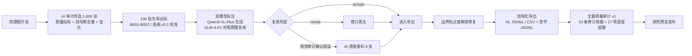

# PhiloVista-1800 技术说明文档

**PhiloVista-1800: A Multi-source Benchmark for Grounded Philosophical Image Understanding**

| | |
|---|---|
| 文档版本 | 1.1（正式 632 框架对齐） |
| 更新日期 | 2026-09-09 |
| 数据集状态 | 研究预览版（research preview）：经复核的 AI 标注草稿，尚非独立人工金标准 |
| 标注语言 | 英文（`en`） |
| 适用范围 | 标注方法研究、流程开发、错误分析、初步模型实验 |

> **阅读前须知**：本文档描述的 1,800 条标注为 AI 工作流产出的草稿，经过生成、复核及后续审计修订。每条记录均显式保留 `formal_gold: false`、`needs_independent_human_annotation: true`、`needs_independent_human_rating: true` 三个字段。在完成独立人工标注与评分之前，本数据集**不应**被描述为最终的人类金标准基准。仓库现已包含 `images/` 中的 1,800 张图片；逐图权利核验状态继续保留在 manifest 中，图片可访问性不表示全部权利事项已完成。

---

## 目录

1. [数据集概述](#1-数据集概述)
2. [设计动机与任务定义](#2-设计动机与任务定义)
3. [数据来源与终选过程](#3-数据来源与终选过程)
4. [构建流程](#4-构建流程)
5. [标注体系与数据结构](#5-标注体系与数据结构)
6. [数据统计](#6-数据统计)
7. [质量控制与审计](#7-质量控制与审计)
8. [数据组织与获取](#8-数据组织与获取)
9. [使用方法](#9-使用方法)
10. [局限性与使用边界](#10-局限性与使用边界)
11. [后续工作计划](#11-后续工作计划)
12. [引用](#12-引用)

---

## 1. 数据集概述

PhiloVista-1800 是面向**有据哲学图像理解**（grounded philosophical image understanding）的多源数据集，包含 1,800 张图片及英文多参考标注。完整 benchmark 由正式 632 概念资源、该数据集、标注规范、评测任务和实验协议共同组成。数据集旨在评估视觉-语言系统能否区分"有视觉证据支撑的哲学/抽象解读"与"缺乏证据的过度解读"（overinterpretation）。

数据集图片汇聚自四个上游数据集（HL Dataset、HAIVMet、IRFL、MM-MoralBench），覆盖伦理与责任、时间与死亡、社会存在、自由与约束等 11 个哲学概念轴，并专门设置 180 张"证据不足"边界样本作为过度解读行为的测量对照。

### 核心规格

| 属性 | 数值 |
|---|---:|
| 图片 / 标注记录数 | 1,800 |
| 正向轨（positive） | 1,620 |
| 边界轨（boundary，证据不足对照） | 180 |
| 每图 Scene 参考 | 3 |
| 每图 Action 参考 | 3 |
| 每图 Rationale 参考 | 3 |
| 每图 Object 参考 | 5 |
| 每图 AI 哲学候选解释 | 3；未来人工/仲裁允许接受 0–3 条 |
| Scene / Action / Rationale 参考总数 | 16,200（1,800 × 9） |
| Object 参考总数 | 9,000（1,800 × 5） |
| 哲学解释总数 | 5,400（1,800 × 3） |
| 旧主题轴 | 11；证据不足另作边界决策标签 |
| 上游来源 | 4 |
| 正式标签资源 | 632 个唯一 PHC ID；不等于实际 gold 覆盖数 |
| 框架 sidecar 正式概念主张 | 0；待人工逐图确认 |

---

## 2. 设计动机与任务定义

### 2.1 问题背景

哲学与抽象层面的图像理解（如图像隐喻、道德情境、象征意义）是视觉-语言模型的高阶能力，本项目关注一种评测风险：如果**只奖励模型给出哲学解读，却不评价证据是否充分**，就可能奖励无据解读。一个对任何图片都能"编出"哲学寓意的模型，与一个只在证据充分时才给出解读的模型，在传统基准上可能获得相同的分数。

### 2.2 任务定义

正式框架定义四个任务，以下是待校准冻结的评测规则，当前尚未发布模型评分器和基线分数：

| 任务 | 目标 | 建议评价 |
|---|---|---|
| T1 视觉证据识别 | 识别对象、动作、关系与图中实际锚点 | 证据准确性、遗漏、虚构事实 |
| T2 哲学概念识别/检索 | 输出正式 PHC 概念或候选排序 | 人工确认核心集上的多标签 F1、Recall@k |
| T3 有据哲学解释 | 每个主张绑定证据，给出限制与替代解释 | 视觉支持、概念契合、连贯性、过度解读风险 |
| T4 充分性与解释克制 | 对相同指定主张判断证据强度 | 充分性 Macro-F1、边界过度解读率、正向有效解释覆盖率 |

主评测输入为图像与统一任务提示，T4 另外提供各模型相同的待判断主张。上游答案、来源、轨道及参考标注派生候选不得进入模型输入。完整条件见 [Benchmark 框架与协议](BENCHMARK_FRAMEWORK.md)。

### 2.3 双轨设计

| 轨道 | 数量 | 定义 | 合格行为 |
|---|---:|---|---|
| 正向轨 | 1,620 | 图像中存在可支持哲学、道德、抽象或比喻推理的可见证据 | 给出锚点明确的哲学解释，并如实标注证据等级 |
| 边界轨 | 180 | 图像本身可正常描述，但强哲学主张缺乏图像依据 | 描述可见内容，同时说明为何无法推出哲学结论 |

边界样本不是损坏图、模糊图或空图——它们是**内容完好但哲学证据不足**的普通图片，专门用于把"描述能力"与"过度解读倾向"解耦。

---

## 3. 数据来源与终选过程

### 3.1 来源构成

| 上游来源 | 正向 | 边界 | 合计 | 说明 |
|---|---:|---:|---:|---|
| HL Dataset | 500 | 100 | 600 | 人工标注的场景-动作-理由三轴图像数据集，提供 HL 兼容格式对齐基础 |
| HAIVMet | 550 | 0 | 550 | 图像隐喻理解数据集，覆盖比喻与象征场景 |
| IRFL | 420 | 80 | 500 | 具身比喻与图像隐喻数据集；500 张全部处于逐图权利核验状态 |
| MM-MoralBench | 150 | 0 | 150 | 道德情境多模态基准样本，含气泡文字（文字依赖即来源于此） |
| **合计** | **1,620** | **180** | **1,800** | |

### 3.2 终选与审计

1,800 张终选图片经过 AI 辅助的视觉与文件双重审计。`final_selection_1800/final_selection_manifest.csv` 为权威 manifest，每张图记录：

- **溯源字段**：`source`、`source_id`、`group_id`、`source_url`、上游类别与短语（仅用于管理员溯源与后验审计，不向标注者展示）；
- **文件完整性**：SHA-256 与 dhash 双哈希、宽高、格式、字节数（PNG 1,150 / JPEG 647 / WEBP 3；宽度 150–4,750 px，中位数 1,000；总大小约 1.44 GB）；
- **质量指标**：信息熵、对比度、边缘强度、综合质量分（11.0–21.8）、语义分与关键词命中；
- **分层字段**：轨道（positive/boundary）、哲学轴、文字依赖等级、是否合成图（合成 700 / 非合成 1,100）；
- **权利状态**：`CC_BY_4_0_dataset_record` 520 张、`source_dataset_terms_review_required` 780 张、`per_image_rights_review_required` 500 张（全部为 IRFL）。

所有 1,800 张图均已分配盲号（`blind_id`：F0001–F1800），盲号与真实 `sample_id` 的映射仅保存在 `final_selection_1800/human_review/blind_image_index.csv` 中，确保标注过程不泄露来源信息。

---

## 4. 构建流程

### 4.1 流程总览



### 4.2 阶段说明

**阶段一：来源汇聚与终选。** 从四个上游数据集汇集候选图片，依据质量指标（信息熵、对比度、边缘强度、语义相关性）与去重审计（SHA-256 精确去重 + dhash 感知去重）筛选，按"来源配额 + 正向/边界轨配额 + 哲学轴覆盖"确定 1,800 张终选集，并完成盲号分配。

**阶段二：先导试标。** 以 100 张先导图（B001–B002 批次）校准标注指南（v0.1-draft），明确四轴问题定义、证据等级判据、哲学扩展的"锚点先行"写作顺序，以及占位词、非法分隔符等禁止事项。

**阶段三：双模型"生成–复核"标注。** 每张图的标注由两次独立的视觉 API 调用完成：

1. **生成**：Qwen3-VL-Plus（主生成模型）读取 base64 图像，一次性产出目标主体、四轴各参考、证据标签、文字依赖等级与 3 份哲学解释；
2. **复核**：GLM-4.6V（主复核模型）独立对照原图审查草稿，输出 `accept` / `revise` 及问题清单；revise 记录回炉修订后再次复核；
3. **兜底与重标**：少量请求在主模型不可用时由 DeepSeek 兜底（生成或复核角色）；6 张图在视觉审计确认错误后由 AI agent 直接重标。

全部 1,800 条记录的生成/复核方法、模型名、请求 ID、token 用量与 UTC 时间戳完整保留在每条记录的 `method` 与 `provenance` 字段中：

| 方法代码 | 记录数 |
|---|---:|
| `dual_api_qwen_generate_glm_visual_review_non_independent` | 1,789 |
| `ai_agent_direct_visual_reannotation_after_audit_non_independent` | 6 |
| DeepSeek 兜底组合 3 种（`dual_api_deepseek_generate_glm_review…` 等） | 4 |
| `dual_api_qwen_generate_glm_review_non_independent` | 1 |
| 合计 | 1,800 |

**阶段四：边界轨修复。** 运行 `repair_boundary_overinterpretation.py` 专项检查 180 张边界样本，确保其哲学解释如实使用 `insufficient` 充分性判定、给出"为何无法从图像推出哲学结论"的说明，而非强行正向解读。

**阶段五：导出与验证。** 由冻结的 `export_english_api_drafts.py` 从逐图 JSON（唯一真源）自动导出 HL JSONL、五列 CSV 与哲学 JSONL，禁止人工直接编辑导出文件；导出器同步生成验证报告（1,800/1,800，零缺失，零错误）。

**阶段六：全量质量审计。** 运行 `audit_annotation_dataset.py` 与配套 notebook 执行全量审计，产出质量报告、逐条修订收据（修改前备份 + 修改后哈希）与优先人工复核清单（详见第 7 节）。

### 4.3 与正式人工流程的关系

本 AI 草稿流程是 `docs/ANNOTATION_PLAN_ZH.md` 中定义的正式人工标注框架（G0 入标 → G1 指南冻结 → G2 批次验收 → G3 发布验收，双人独立筛选、每图三名独立主标注者、独立置信度评分与哲学双评）的**先导实现与方法学验证**。AI 草稿不可替代该流程中"作者与评分者隔离""双人独立提交"等独立性要求，这也是当前版本保留 `non_independent` 方法标记的原因。

---

## 5. 标注体系与数据结构

### 5.0 正式 632 概念资源

版本为 `formal-632-20260909`，包含本体论 158、认识论 132、价值论 342 个概念。`candidate` 为 416，`ontology_only` 为 216；当前未确认数据集对全部概念的覆盖。

- 概念层：`Philosophical Concept`，由 `Concept ID` 唯一标识。
- 具象层：`Symbolic Keywords` 与 `Visual Evidence Patterns`，分别表示关键词线索与通用视觉模式。
- 约束字段：`Visual Inferability`、`Temporal Requirement`、`Grounding Rule`。

关键词可能含有解释性含义；通用模式也不是逐图证据。标注必须记录实际锚点，再说明它如何支持某概念，不能把关键词匹配机械转成标签。`symbolic_mapping` 保存映射过程，不要求另建独立象征标签层。字段定义见 [正式标签说明](../ontology/README.md)。

### 5.1 四轴多参考描述（HL 兼容）

每图包含四个轴的多条 AI 参考描述，字段格式与 HL Dataset 对齐；多条文本不代表独立人工判断，也不直接提供人工置信度等评分字段：

| 轴 | 参考数 | 问题 | 写作要求 |
|---|---:|---|---|
| Scene | 3 | 画面处于什么场景？ | 只写图中可支持的地点或情境，避免超出证据的具体化 |
| Action | 3 | 主体正在做什么？ | 优先可见动作；无动作时写可见状态，不补造不可见历史 |
| Rationale | 3 | 主体为何这样做 / 情境为何出现？ | 允许合理常识推断；证据不足时使用"仅凭图像无法确定"式表述 |
| Object | 5 | 关键对象与构图 | 完整具体的视觉描述句子，非标签堆叠；每条独立成立 |

每条 Rationale 附带证据等级标签 `rationale_support`：

| 标签 | 含义 | 条数（共 5,400） |
|---|---|---:|
| `visual_support` | 目的/原因有直接可见线索 | 3,221 |
| `commonsense_inference` | 合理但仍是常识推测 | 367 |
| `insufficient_evidence` | 画面无法区分目的，需使用"无法确定"表述 | 1,811 |
| `not_applicable` | 无可适用的行动或目的对象 | 1 |

每条记录还标注整图 `text_dependency`（none/low/medium/high），刻画理解该图对图中文字的依赖程度（如漫画气泡、招牌）。

### 5.2 哲学解释扩展

当前 AI 草稿每图附 3 份候选哲学解释，强制"锚点先行"的写作结构；它们不是三位独立人工标注者的答案。正式人工记录允许保留 0–3 条合格解释。

| 字段 | 内容 |
|---|---|
| `visual_anchors` | 至少 1 个可在图中指出的对象、位置、关系、姿态或文字（禁止直接写抽象概念） |
| `symbolic_mapping` | 锚点到抽象含义的跨域映射（如"岔路 → 互斥的人生选择"）；无明确象征中介时可为空 |
| `legacy_axis_ids` | 旧 AI 草稿中的 11 个粗主题轴，只用于溯源和候选检索 |
| `formal_concept_candidates` | crosswalk 返回的 `PHC-xxx` 检索候选，不是正式标签 |
| `concept_claims` | 人工逐概念确认后的 PHC ID、有限主张、锚点索引、映射索引、充分性和限制；AI 草稿中保持为空 |
| `interpretation` | 综合解释正文 |
| `alternative_interpretations` | 替代解释（含非哲学的平实解读） |
| `limitations` | 证据限制说明 |
| `sufficiency` | 证据充分性：`supported` / `plausible` / `insufficient`（边界样本合格答案必须为 `insufficient` 或明确说明不可推出） |

旧版草稿使用 11 个正向粗主题轴（与 manifest 的 `philosophical_axis` 分层一致），它们不是正式 632 标签体系中的哲学概念：

`ethics_responsibility`（伦理与责任）、`social_existence`（社会存在）、`identity_appearance`（身份与表象）、`time_mortality`（时间与死亡）、`knowledge_truth`（知识与真理）、`power_conflict`（权力与冲突）、`choice_journey`（选择与旅程）、`labor_technology`（劳动与技术）、`freedom_constraint`（自由与约束）、`faith_meaning`（信仰与意义）、`other_abstract_relation`（其他抽象关系）。边界轨在 manifest 中记为 `insufficient_evidence` 轴。

### 5.3 记录示例（节选）

逐图 JSON（`annotation_workflow/drafts/api_en/items/F0001.json`，节选）：

```json
{
  "annotation_item_id": "F0001",
  "sample_id": "PHL1800_HAIV_0475",
  "file_name": "PHL1800_HAIV_0475.png",
  "batch_id": "B003",
  "language": "en",
  "method": "dual_api_qwen_generate_glm_visual_review_non_independent",
  "formal_gold": false,
  "target_subject": "a single stylized human figure interacting with a burning stack of material",
  "captions": {
    "scene":  ["... 3 条 ..."],
    "action": ["... 3 条 ..."],
    "rationale": ["... 3 条 ..."],
    "object":  ["... 5 条 ..."]
  },
  "rationale_support": ["visual_support", "visual_support", "insufficient_evidence"],
  "text_dependency": "medium",
  "philosophy_interpretations": [
    {
      "candidate_id": "AI_F0001_P1",
      "visual_anchors": ["flame engulfing the figure's head", "hands on burning pile", "text 'FGOLD' inside flame"],
      "symbolic_mapping": ["fire as consuming force", "text as labeled value or identity"],
      "concept_ids": ["power_conflict", "identity_appearance"],
      "interpretation": "The figure appears subjected to an external force (fire) ...",
      "alternative_interpretations": ["The image may depict literal firefighting ..."],
      "limitations": ["No contextual signage ... confirm symbolic intent"],
      "sufficiency": "plausible"
    }
    "... 共 3 份 ..."
  ],
  "needs_independent_human_annotation": true,
  "needs_independent_human_rating": true,
  "review": { "reviewer_model": "glm-4.6v", "verdict": "accept", "issues": [] },
  "provenance": {
    "generated_at_utc": "2026-09-06T17:46:41Z",
    "primary": { "provider": "qwen", "model": "qwen3-vl-plus", "request_id": "..." },
    "review":  { "provider": "glm",  "model": "glm-4.6v",   "request_id": "..." },
    "image_input": "base64_from_local_selected_image"
  }
}
```

上例是保留不变的原始 AI 草稿格式。框架对齐导出 `PhiloVista-1800_framework.jsonl` 将该字段改名为 `legacy_axis_ids`，另列 `formal_concept_candidates`，并在人工逐图确认前保持 `concept_claims: []`。

HL 兼容导出行（`PhiloVista-1800_HL.jsonl`）：

```json
{
  "file_name": "PHL1800_HAIV_0475.png",
  "captions": {
    "scene":     ["...", "...", "..."],
    "action":    ["...", "...", "..."],
    "rationale": ["...", "...", "..."],
    "object":    ["...", "...", "...", "...", "..."]
  }
}
```

> 说明：发布 Schema（`hl_release_record.schema.json`）在顶层额外定义了 `confidence`（逐参考 1–5 置信度）、`purity`、`diversity` 三个字段，供正式人工评分阶段使用。当前 AI 草稿的导出仅含 `file_name` 与 `captions`，不含占位分数。

### 5.4 机器可读 Schema

- `annotation_workflow/schemas/hl_release_record.schema.json`：HL 风格发布记录（含 confidence/purity/diversity 的正式定义，约束参考数量 3/3/3/5、禁用全角分号等）；
- `annotation_workflow/schemas/philosophy_record.schema.json`：哲学扩展发布记录（含双人独立评分 `reviewer_scores` 与仲裁 `adjudication` 的正式定义，供人工评分阶段填充）。
- `annotation_workflow/schemas/framework_draft_record.schema.json`：框架对齐 AI 草稿记录；显式禁止把候选写成正式 `concept_claims`。

---

## 6. 数据统计

### 6.1 分层分布

**来源 × 轨道**：

| 来源 | 正向 | 边界 | 合计 |
|---|---:|---:|---:|
| HL Dataset | 500 | 100 | 600 |
| HAIVMet | 550 | 0 | 550 |
| IRFL | 420 | 80 | 500 |
| MM-MoralBench | 150 | 0 | 150 |

**哲学轴分布**（manifest `philosophical_axis`，边界轨计入 `insufficient_evidence`）：

| 哲学轴 | 图片数 |
|---|---:|
| social_existence | 263 |
| ethics_responsibility | 252 |
| identity_appearance | 160 |
| time_mortality | 155 |
| knowledge_truth | 153 |
| power_conflict | 140 |
| choice_journey | 107 |
| labor_technology | 102 |
| freedom_constraint | 93 |
| faith_meaning | 73 |
| other_abstract_relation | 122 |
| insufficient_evidence（边界轨） | 180 |

**整图文字依赖**（`text_dependency`）：

| 等级 | none | low | medium | high |
|---|---:|---:|---:|---:|
| 记录数 | 831 | 519 | 387 | 63 |

### 6.2 哲学解释统计

**证据充分性**（5,400 份解释）：

| 充分性 | 份数 | 占比 | 说明 |
|---|---:|---:|---|
| `plausible` | 3,785 | 70.1% | 有锚点支持的合理解读 |
| `insufficient` | 1,593 | 29.5% | 明确说明证据不足（含全部边界样本的合格答案） |
| `supported` | 22 | 0.4% | 极少数图像证据直接支持哲学结论的个案 |

**旧主题轴使用频次**（5,400 份解释的旧 `concept_ids`；框架对齐导出中名为 `legacy_axis_ids`，共 11 个轴）：

| 概念 | 使用次数 | | 概念 | 使用次数 |
|---|---:|---|---|---:|
| social_existence | 1,961 | | knowledge_truth | 1,005 |
| identity_appearance | 1,581 | | power_conflict | 643 |
| freedom_constraint | 1,355 | | labor_technology | 555 |
| choice_journey | 1,149 | | ethics_responsibility | 535 |
| time_mortality | 1,048 | | faith_meaning | 149 |
| | | | other_abstract_relation | 74 |

### 6.3 复核判定分布

当前 1,800 条草稿的复核与后续审计修订状态（包含 GLM 复核及后续处理，不等于全部由 GLM 作出的新判定）：

| 判定 | 记录数 |
|---|---:|
| `accept`（当前记录状态） | 1,578 |
| `revised_after_review`（复核问题已在当前正文解决） | 201 |
| `revised_by_audit_visual_inspection`（视觉审计后修正） | 21 |
| `revise`（仍需复核） | 0 |

### 6.4 文本长度（英文词数）

| 轴 | 最小 | 中位数 | P90 | 最大 |
|---|---:|---:|---:|---:|
| Scene | 5 | 17 | 24 | 52 |
| Action | 6 | 16 | 23 | 74 |
| Rationale | 9 | 20 | 26 | 58 |
| Object | 8 | 21 | 29 | 79 |

---

## 7. 质量控制与审计

### 7.1 自动化审计结果（audit/annotation_quality_v1）

审计版本 1.0.0，本次报告日期为 2026-09-09，覆盖全部 1,800 条记录：

| 检查项 | 结果 |
|---|---|
| 记录解析 / 唯一标注 ID | 1,800 / 1,800 ✅ |
| 严重（critical）/ 高危（high）发现 | 0 / 0 ✅ |
| 图片可解码且 SHA-256 与 manifest 一致 | 1,800 / 1,800 ✅ |
| CSV ↔ JSONL 往返一致 | 1,800 / 1,800 ✅ |
| 英文字段中的 CJK 字符 | 0 ✅ |
| 非法全角分号分隔符 | 0 ✅ |
| 敏感数据泄露 | 0 ✅ |
| 上游文本泄露（与源短语/标签的匹配） | 0 ✅ |
| Schema 形态变体 | 1（统一形态）✅ |
| 发布就绪度 | `conditionally_ready` |

### 7.2 修订过程

早期修订收据记录了 33 个唯一条目；后续框架视觉复核另记录九条修复，见 [修复说明](../audit/framework_alignment_20260909/visual_repairs.md)。不同修订批次可能重叠，不能简单相加作为唯一修订数。全部修订遵守**留痕原则**：修改前原文备份、修订原因、修改字段、修订前后 SHA-256 均记录在 `PhiloVista-1800_repair_log.jsonl` 中，不覆盖原始提交。

### 7.3 遗留问题（17 项，均为 medium）

审计后仍有 17 项 medium 级人工复核提醒，已列入 `PhiloVista-1800_priority_human_review.csv`：

- **16 项跨图精确复用（`cross_image_exact_reuse`）**：同一句规范化的"图中无任何可读文字"类 Object 陈述在 6 张图间重复。复核确认各句在其图中均**属实**（这些图确实不含文字），属于事实正确的保守表述复用，而非内容错误；
- **1 项轴内近重复（`within_axis_near_duplicate`）**：一对镜像构图（两尊相对的雕塑）的两条 Action 描述词面 Jaccard 相似度为 1.00。复核确认镜像动作本身即导致措辞对称，属于内容准确的低词面多样性，而非复制错误。

审计原则明确：质量指标用于发现问题，**不把低词面多样性自动判为错误**，也不为提高表观分数强迫改写真实一致的判断。

### 7.4 质量门禁框架

本数据集按四道门禁（G0 入标 → G1 试标与指南冻结 → G2 批次验收 → G3 发布验收）管理，配套 36 个盲批次（每批 50 张）、数据状态机（selected → … → frozen → released）与已实现的组级分区（calibration 180 / dev 180 / test 1,440，`group_id` 跨 split 数为零；不表示穷尽所有潜在近重复）。完整定义见 `docs/ANNOTATION_PLAN_ZH.md` 与 `annotation_workflow/annotation_config.json`。当前发布已提供 AI 草稿、框架 sidecar 和固定研究分区；G0–G3 的人工环节仍待完成。参考草稿公开可见，该分区不是隐藏测试服务。

---

## 8. 数据组织与获取

### 8.1 仓库结构

```text
PhiloVista-1800/
├── README.md                                  # 英文总览
├── README_ZH.md                               # 中文总览
├── images/                                    # 已包含的 1,800 张图片
├── ontology/                                  # 正式 CSV、版本锁及字段说明
├── splits/benchmark_splits.csv                # 固定组级分区
├── docs/
│   ├── TECHNICAL_REPORT_ZH.md                 # 本文档
│   ├── ANNOTATION_PLAN_ZH.md                  # 1,800 张标注执行计划（人工流程框架）
│   ├── ANNOTATION_WORKFLOW.md                 # 工作流目录说明与隔离规则
│   └── ANNOTATOR_GUIDE.md                     # 标注员操作指南（试标草案 v0.1）
├── final_selection_1800/
│   ├── final_selection_manifest.csv           # 权威终选 manifest（1,800 行 × 34 列）
│   └── human_review/blind_image_index.csv     # 盲号 ↔ sample_id 映射
├── annotation_workflow/
│   ├── annotation_config.json                 # 冻结的数量/角色/门禁/格式参数
│   ├── admin/batch_items.csv                  # 36 个盲批次（仅管理员）
│   ├── schemas/                               # HL 与哲学扩展发布 Schema
│   ├── scripts/                               # 生成、修复、导出、审计脚本
│   └── drafts/api_en/
│       ├── items/                             # F0001–F1800 逐图标注 JSON（真源）
│       └── exports/
│           ├── PhiloVista-1800_HL.jsonl       # HL 兼容导出（1,800 行）
│           ├── PhiloVista-1800_HL.csv         # 五列 HL 兼容导出（1,800 行）
│           ├── PhiloVista-1800_philosophy.jsonl  # 哲学扩展导出（1,800 行）
│           ├── PhiloVista-1800_framework.jsonl # 框架对齐 sidecar
│           └── PhiloVista-1800_validation_report.json
└── audit/annotation_quality_v1/               # 质量报告、审计 notebook、修订日志、复核清单
```

### 8.2 导出产物与校验哈希

| 文件 | 大小 | SHA-256（前 16 位） |
|---|---:|---|
| `PhiloVista-1800_HL.jsonl` | 3.38 MB | `5b1662a3969101be1…` |
| `PhiloVista-1800_HL.csv` | 3.21 MB | `cec86c27074769b5…` |
| `PhiloVista-1800_philosophy.jsonl` | 5.48 MB | `e7d63c026eaa66ed…` |

五列 CSV 沿用 HL 兼容的固定中文列名（`图片文件名,Scene场景描述,Action动作描述,Rationale理由描述,Object物体描述`），单元格内多条参考以全角分号 `；`（U+FF1B）连接，单条参考内部禁用该字符；编码 UTF-8（CSV 带 BOM）。

### 8.3 图片获取

本仓库已包含 `images/` 中的 1,800 张图片，读取路径为 `images/<file_name>`。manifest 保留原始选图目录、来源、SHA-256、dhash、尺寸和逐图权利状态。图片在仓库可访问，不表示待核验的上游条款或逐图权利已经解决。

---

## 9. 使用方法

### 9.1 读取 HL 导出

```python
import json
from pathlib import Path

path = Path("annotation_workflow/drafts/api_en/exports/PhiloVista-1800_HL.jsonl")
records = [json.loads(line) for line in path.read_text(encoding="utf-8").splitlines()]

print(len(records))                              # 1800
print(records[0]["file_name"])                   # PHL1800_HAIV_0475.png
print(records[0]["captions"]["scene"])           # 3 条场景参考
```

### 9.2 读取五列 CSV

```python
import pandas as pd

df = pd.read_csv(
    "annotation_workflow/drafts/api_en/exports/PhiloVista-1800_HL.csv",
    encoding="utf-8-sig",
)
print(df.shape)   # (1800, 5)
```

### 9.3 读取哲学扩展

```python
import json

with open("annotation_workflow/drafts/api_en/exports/PhiloVista-1800_philosophy.jsonl",
          encoding="utf-8") as f:
    for line in f:
        rec = json.loads(line)
        for interp in rec["interpretations"]:
            print(rec["file_name"], interp["sufficiency"], interp["concept_ids"])
```

### 9.4 与 manifest 关联分层

```python
import csv, json
from pathlib import Path

with open("final_selection_1800/final_selection_manifest.csv", encoding="utf-8-sig") as f:
    meta = {r["sample_id"]: r for r in csv.DictReader(f)}

item = json.loads(Path("annotation_workflow/drafts/api_en/items/F0001.json")
                  .read_text(encoding="utf-8"))
row = meta[item["sample_id"]]
print(row["track"], row["philosophical_axis"], row["text_dependency"])
```

### 9.5 从逐图 JSON 重建导出

```bash
python annotation_workflow/scripts/export_english_api_drafts.py
```

### 9.6 复跑全量审计

安装 `requirements.txt` 中的依赖后运行；审计兼容历史选图目录，并在文件不存在时读取仓库 `images/`：

```bash
python annotation_workflow/scripts/audit_annotation_dataset.py
```

---

### 9.7 重建框架产物

```bash
python annotation_workflow/scripts/build_framework_release.py
```

脚本默认使用仓库内正式 CSV，生成版本锁、框架 sidecar 和固定分区。`formal_concept_candidates` 是候选检索建议，`concept_claims` 在人工确认前为空。详见 [框架对齐说明](FRAMEWORK_ALIGNMENT_ZH.md)。

## 10. 局限性与使用边界

1. **非金标准**。全部标注为 AI 生成并经另一 AI 复核的草稿，生成与复核**非独立**（同一工作流）。未经独立人工标注与评分前，不得用于对模型能力作最终结论，也不得表述为"人工标注基准"。
2. **单一模型家族的偏置**。1,789/1,800 的记录由 Qwen3-VL-Plus 生成、GLM-4.6V 复核，标注风格与判断边界受两个模型的能力分布影响（如措辞模板化倾向、概念选择的覆盖偏差）。
3. **哲学解释的充分性分布不均衡**。`supported` 仅 22 份，`insufficient` 集中于边界轨；直接用充分性字段做类别预测评测时需注意类不平衡。
4. **图片已包含、权利未完全核验**。780 张需按上游数据集条款复核、500 张（IRFL）需逐图权利核验；仓库可用性不授予上游图像内容或元数据的任何权利。
5. **未声明许可证**。在仓库添加许可证之前，除依适用法律及上游条款对仓库内容进行查看与评估外，不得假定任何使用许可。
6. **来源与轨道存在关联**。边界图只来自 HL 和 IRFL，应报告来源内部的正向/边界表现；不能把来源风格识别当成证据判断能力。
7. **已知的 17 项 medium 提醒未人工仲裁**（见 7.3 节），其中 16 项为事实正确的重复表述，1 项为镜像构图的对称描述。
8. **confidence / purity / diversity 字段尚为空**。这三个 HL 字段依赖独立人工评分与冻结的指标实现，当前导出不含占位值；请勿在评测中假设其存在。

---

## 11. 后续工作计划

按 `docs/ANNOTATION_PLAN_ZH.md` 的框架，从当前预览版推进到正式版需完成：

| 阶段 | 内容 | 对应门禁 |
|---|---|---|
| 双人独立盲筛 | 1,800 张图 × 2 名筛选者独立完成入标判定；冲突交第三人仲裁；备选池替补 | G0 |
| 权利核验 | 逐图核验上游条款，优先处理 500 张 IRFL | G0 |
| 指南冻结 | 基于试标一致性（weighted kappa ≥ 0.60；Krippendorff's α ≥ 0.67）冻结指南 v1.0 | G1 |
| 独立人工标注 | 每图 3 名主标注者独立提交四轴各 1 条 + 1 份哲学解释；2 名补充标注者补足 Object 至 5 条（五条来自五个不同的人） | 生产批次 |
| 独立评分 | HL 置信度逐参考 1–5 分（作者不可评本人文本）；哲学解释双评（4 维度 + verdict） | 生产批次 |
| 人工 PHC 映射与核心集 | 逐概念证据绑定、仲裁前一致性、核心标签样本覆盖及近邻区分核验 | 生产批次 |
| 正式冻结 | 已有 180/180/1,440 研究分区；人工阶段复核分组与泄漏、计算 purity / diversity、完成 G3 验收 | G3 |
| 评测实现与基线 | 冻结四任务评分规则，比较直接解读、锚点优先、概念检索和证据约束 | 实验阶段 |

AI 草稿在该流程中的定位是：**流程验证、指南校准的参照系与人工标注的质量先验**，而非最终数据。人工提交完成后，逐图 JSON 中的 provenance 与审计收据可用于对照分析人机差异。

---

## 12. 引用

如使用本数据集（研究预览版），请引用：

```bibtex
@misc{philovista1800_2026,
  title        = {PhiloVista-1800: A Multi-source Benchmark for Grounded Philosophical Image Understanding},
  author       = {SimonJYTP},
  year         = {2026},
  howpublished = {GitHub repository},
  url          = {https://github.com/SimonJYTP/PhiloVista-1800-A-Multi-source-Benchmark-for-Grounded-Philosophical-Image-Understanding}
}
```

使用时请同时遵守四个上游数据集（HL Dataset、HAIVMet、IRFL、MM-MoralBench）各自的许可与引用要求。

问题与勘误请通过 GitHub Issues 提交。
